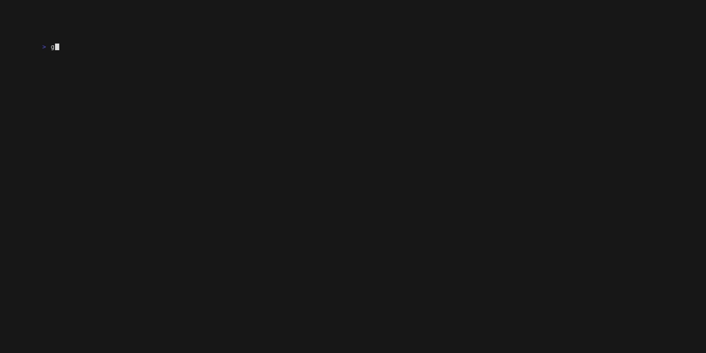

# GTop

[](https://drone.mathob-jehanno.com/mJehanno/gtop)
[](https://sonar.mathob-jehanno.com/dashboard?id=gtop)
[](https://goreportcard.com/report/github.com/mjehanno/gtop)

## Introduction

GTop is an alternative to `top` or `htop` made in Go.

It uses [bubbletea](https://github.com/charmbracelet/bubbletea) under the hood.

The main difference with top/htop is the idea of displaying more data in a simpler way.


It currently only support Linux.


## Installation

### AUR

```bash
git clone https://aur.archlinux.org/gtop.git
cd gtop
makepkg -si
```

### Go

`go install github.com/mjehanno/gtop@latest`

### Tarball

Download one of the release archive, then extract it (`tar -xzf [filename].tar.gz`), 
then add the path to the new folder in your $PATH environment variable (you probably in your `~/.bashrc`, `~/.zshrc` or `~/.profile`)


## Usage



